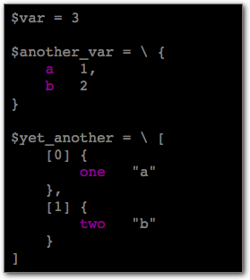

Chat transcript from 2020-09-10 Cinci.pm meeting
================================================

* Deven's favorite Getopt::Long options

        use Getopt::Long qw[:config gnu_compat bundling no_getopt_compat require_order];

    * `:config` allows the following configuration options to be specified in
      the `use` statement, which is easier than explicitly calling
      `Getopt::Long::Configure()`.

    * `gnu_compat` enables `--opt=value` like GNU `getopt_long()` does, while
      still supporting `--opt value`, that way the user can use whichever form
      they prefer.

    * `bundling` allows single-letter options to be clustered together into a
      single cluster, like `ps -ef` instead of `ps -e -f`

    * `no_getopt_compat` disables the `+opt` long option alternative to `--opt`

    * `require_order` disallows mixing options with arguments, requiring all
      options to be specified before all non-option arguments.  This is the
      traditional Unix style, but GNU and `Getopt::Long` default to the opposite
      mode, which `Getopt::Long` calls "permute".

* Mike L.'s favorite `rsync` flags: `-avPHS`
    * `-a` → `-rlptgoD` (recursive, copy symlinks as symlinks, preserve perms, preserve mtimes, preserve group and owner, and
      preserve special device files and special files)
    * `-v` → show what you're doing
    * `-P` → same as `--partial --progress`
    * `-H` → preserve hard links
    * `-S` → convert sequences of nulls into sparse blocks (takes up less space
      on the destination when the file has "holes" in it)

* Deven mentioned that `perl -de 0` is a reasonable poor man's REPL

* Chris offered up this method for giving `GetOptions` a hash reference

        ## Command line options
        our %clo = (
          d => \$debug,
          v => \$verbose,
          sep => "~",
          help => sub { print $helptext; exit; },
        );
        
        GetOptions(\%clo, qw[ d|debug+ v|verbose! limit|l=i sep|s=s
            template|t=s header1! headers=s numerify|n=i@
            trim! etrim! sp! recsep|r=s crlf! help|h|?
        ]) or die $shorthelp;

* Deven offered this alternative to global hard-coded parameters:

        GetOptions(
           "opt" => \( our $opt= "default value" ),
           ⋮

* Deven provided this example usage for [HTML::FromANSI][hfa]

        use Data::Printer;
        use HTML::FromANSI qw[ansi2html];

        my $var = (1, 2, 3);
        my $another_var = { a => 1, b => 2 };
        my $yet_another = [ { one => 'a' }, { two => 'b' } ];

        my $output =
            join "\n",
            map { my $value = eval $_;
                  sprintf "%s = %s\n", $_, np($value, colored => 1);
                }
            qw[ $var $another_var $yet_another ];

        my $html = sprintf <<'EOF', ansi2html($output);
        <!DOCTYPE html>
        <html>
          <head>
            <title>DEBUG</title>
          </head>
          <body style="background-color: black">
            %s
          </body>
        </html>
        EOF

        my $outf, '>', 'output.html';
        print $outf $html;
        close $outf;

    * produces this HTML in the browser:

      

* Mike C. provided the following example usage for [Data::Printer][ddp] (a
  featureful pretty-printer, alternative to Data::Dumper)

        use DDP; p %foo;
        use DDP; &p($foo->method)

    * Deven notes: `p()` goes straight to terminal though, I was using `np()`
      above, which returns what `p()` would normally print

* Deven pointed out there was a Vim plugin to conceal ANSI escapes with the
  actual color they produce: [(Improved) AnsiEsc.vim][iae]

[hfa]: https://metacpan.org/pod/HTML::FromANSI
[iae]: https://github.com/powerman/vim-plugin-AnsiEsc
[ddp]: https://metacpan.org/pod/Data::Printer
